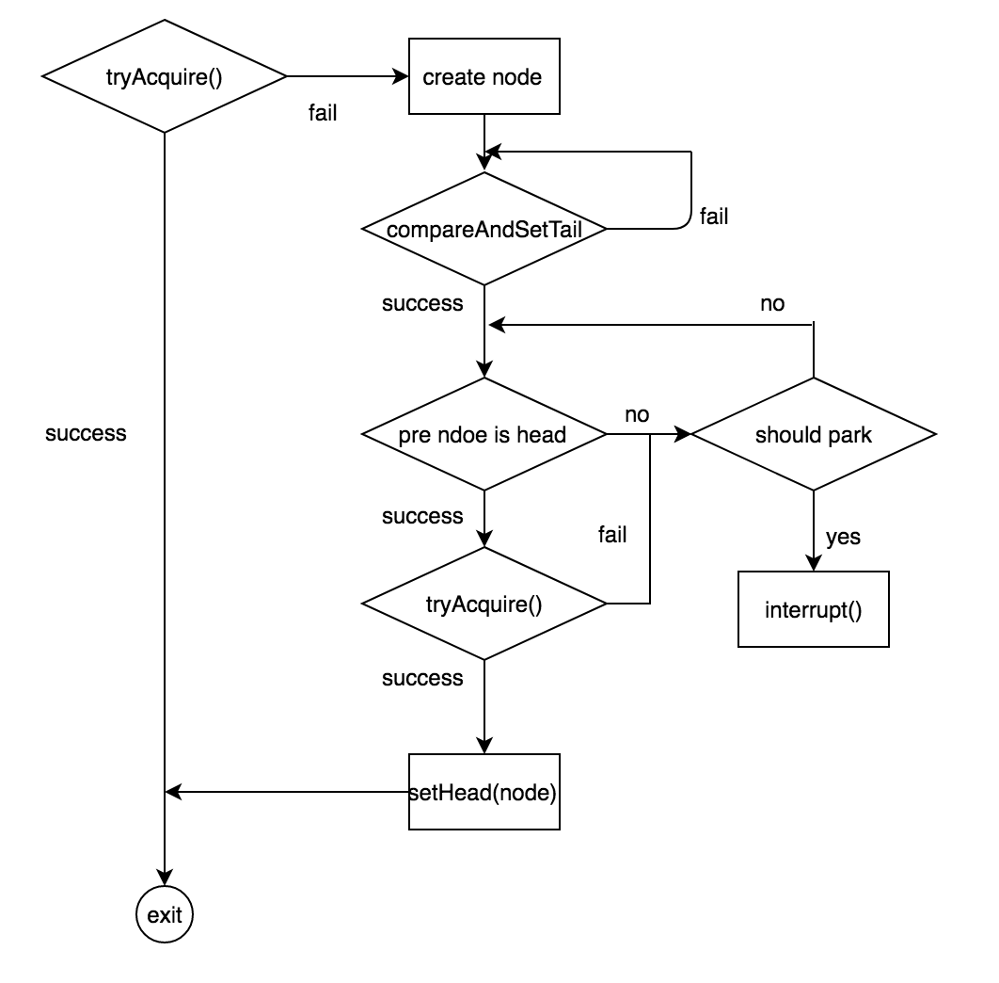

### 同步器

锁的实现依赖同步器，同步状态获取成功代表着当前线程获取了锁；

### AbstractQueuedSynchronizer类中主要方法

proctected final修饰，子类可以继承，但**不可以重写**,

作用：作为系统工具方法，和底层交互；

* compareAndSetState(expect, update)  
* setState(newState)  
* getState()

protected修饰，子类可以继承和**可以重写**，执行时抛出 UnsupportedOperationException不支持此运算异常

作用：用来自定义同步逻辑

* tryAcquire()  
* tryRelease()  
* tryAcquireShared()  
* tryReleaseShared()  
* isHeldExclusively()

public final修饰，任何类可以调用，但**不可以重写**

作用：锁Lock直接利用这些方法

* acquire()  
* acquireInterruptibly()  
* tryAcquireNanos(nanosTimeout)  
* release()  
* acquireShared()  
* acquireSharedInterruptibly()
* tryAcquireSharedNanos(nanosTimeout)  
* releaseShared()

### 执行逻辑 

**独占式获取同步状态**

acquire()调用tryAcquire()  来获取同步状态，若获取成功则正常往下执行，若获取失败则新建一个节点Node并插入同步队列的尾部。获取状态失败的节点（线程）会在同步队列中进行自旋，直到其prev节点是head节点且获取同步状态成功才退出自旋。

节点的状态

* CANCALLED=1取消状态

  前一个节点是取消状态，就把前一个节点删除，不挂起当前节点；

* SIGNAL=-1等待触发状态

  前一个节点是等待触发状态，则挂起当前节点，调用LockSupport中的park()方法阻塞当前线程；

* CONDITION=-2等待条件状态

  设置当前节点为SIGNAL状态，不挂起当前节点；

* PROPAGATE=-3状态需要向后传播

  设置当前节点为SIGNAL状态，不挂起当前节点；

**共享式获取同步状态**

acquireShared()调用tryAcquireShared()

